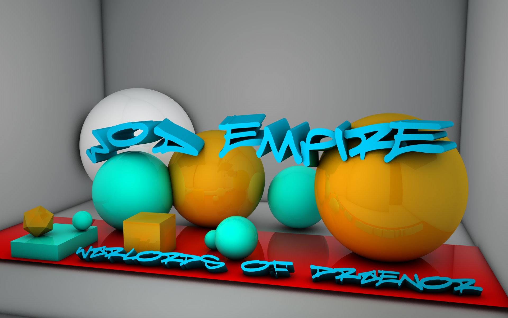

	

	
LightUp is a Fast,lightweight and well simplified gallery lightbox designed to enable novice,intermediate and advance developers achieve a simple image navigation activities. This plugin is easy to use

# FEATURES INCLUDE
 Fullscreen - You have the option to allow fullscreen of the plugin for wider view of images  
 Download - You have the option to download the currently viewing image onto your computer  
 Information - You have the option to view information about the image , it been the size,date,time,name and others ...  

# USAGE
 ## HTML
	

		
		
	

 ## Plugin
	 

## Options
 useImageAsBackground: This allows the plugin to set the images as a background with blurred effect and animations. It uses 
 boolean values ( True or False).  
 hideHeader: This allows the plugin to set the header visibility, as to whether to show the header or fade the header. It 
 uses boolean values either True or False  
	
## COMING SOON
 Share - You will be able to share the currently viewing image with various platforms  
 Autoplay - You will be able to allow the images to play automatically  
## CONTACT INFO
 email : offeilord@gmail.com , acheampong.lord@yahoo.com
 
## WORK IN PROGRESS 

